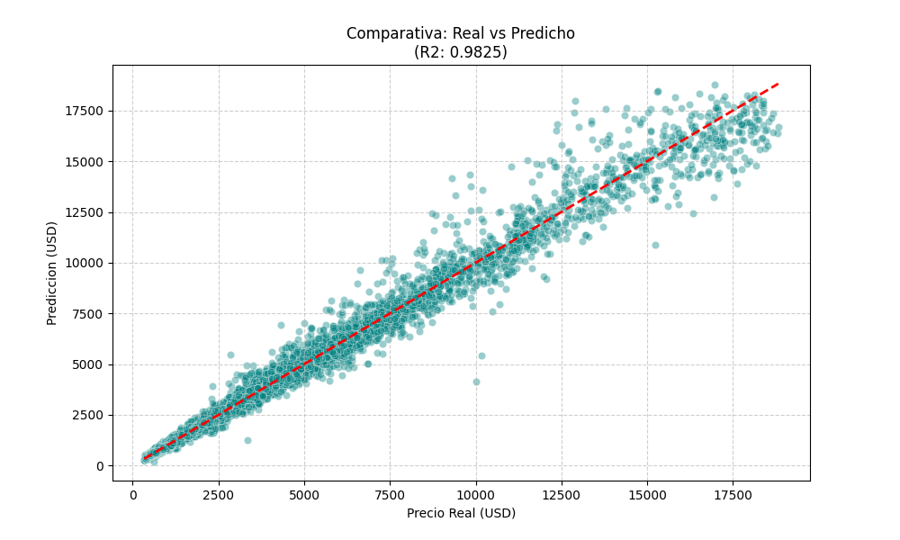
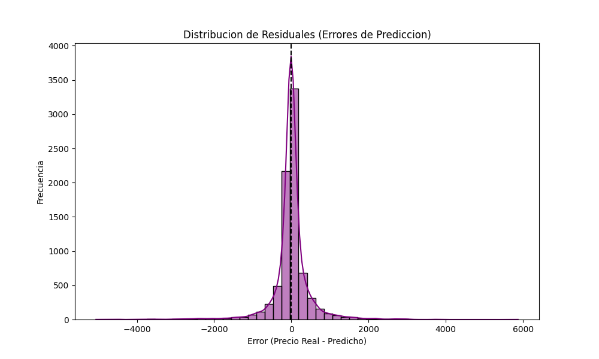

## 🏗️ Estructura del Proyecto

```text
├── data/           # Datasets originales y procesados.
├── notebooks/      # Análisis exploratorio (EDA) y prototipado.
├── src/            # Código fuente modular (limpieza, ingeniería, entrenamiento).
├── models/         # Modelos serializados (archivos .pkl o .h5).
├── main.py         # Orquestador principal (Entrenamiento)
├── inference.py    # Consumo del modelo (Prediccion)
└── requirements.txt # Dependencias del proyecto.

```

## 📊 Data Source

Los datasets utilizados en este proyecto provienen de la competición de Kaggle:
* **Competición:** [CEUPE - Big Data Analytics](https://www.kaggle.com/competitions/ceupe-big-data-analytics)
* **Dataset:** 
- `diamonds_train.csv` (conjunto para entrenamiento incluido en la sección de data de la competición).
- `diamonds_test.csv`
- `sample_submission.csv` 
> **Nota:** Debido a las políticas de Kaggle y al peso de los archivos, los datos crudos no se encuentran en este repositorio. Deben descargarse manualmente y colocarse en `data/raw/`.


## 🛠️ Pipeline de Ingeniería

A diferencia de un análisis convencional, este repositorio implementa un flujo de trabajo estructurado:

1. **Data Cleaning:** Tratamiento de *outliers* en dimensiones críticas (x, y, z) y manejo de valores inconsistentes en profundidad y tabla.
2. **Feature Engineering:** Codificación de variables categóricas (*Cut, Color, Clarity*) utilizando mapeos ordinales para capturar la jerarquía de calidad.
3. **Modeling:** Evaluación comparativa entre regresión lineal múltiple y modelos basados en ensamble (*Random Forest*).
4. **Validation:** División de datos mediante Hold-out para una evaluación inicial, con planes de implementar K-Fold Cross-Validation durante la fase de optimización de hiperparámetros.

## 📊 Métricas de Rendimiento

El modelo final se evalúa bajo las siguientes métricas de regresión:

| Métrica | Descripción | Valor obtenido |
| --- | --- | --- |
| **R² Score** | Coeficiente de determinación | `0.98` |
| **RMSE** | Root Mean Square Error | `$526.24` |
| **MAE** | Mean Absolute Error | `$264.95` |

## 🧠 Conclusiones y Hallazgos

* **Poder Predictivo:** El modelo alcanza un **R² de 0.98**, lo que demuestra que las características físicas de los diamantes (x, y, z y quilates) tienen una relación matemática casi lineal-exponencial con el precio de mercado.
* **Análisis de Error:** El **MAE de $264.95** indica una alta precisión para el rango medio de precios. Sin embargo, la diferencia con el **RMSE ($526.24)** sugiere que el modelo enfrenta mayores dificultades con los *outliers* (diamantes de extrema rareza o precios muy elevados), donde la variabilidad es mayor.
* **Eficiencia del Pipeline:** Gracias a la arquitectura modular y el uso de formatos **Parquet**, el ciclo completo desde la ingesta hasta la evaluación se ejecuta en menos de 10 segundos, permitiendo una iteración rápida para experimentos de *Fine-tuning*.
* **Jerarquía Ordinal:** La codificación manual de la calidad (*Cut, Color, Clarity*) resultó ser superior a una codificación simple, confirmando que respetar el conocimiento de dominio del sector joyero mejora la estabilidad del modelo.

A continuación se presentan los resultados visuales de la evaluación del modelo:

### Comparativa: Real vs. Predicho
Este gráfico muestra la alta correlación entre las predicciones y los valores reales. La alineación con la diagonal confirma un $R^2$ de 0.98.


### Distribución de Residuales
La simetría de los errores alrededor del cero indica que el modelo es insesgado, aunque las colas del histograma reflejan la presencia de valores atípicos en diamantes de alto valor.



## Próximos Pasos

* [ ] Implementación de optimización de hiperparámetros con **Optuna**.
* [ ] Creación de una API con **FastAPI** para servir el modelo.
* [ ] Desarrollo de una interfaz de usuario en **Streamlit**.


## 🚀 Instalación y Uso

Para replicar este entorno de ingeniería, siga estos pasos:

1. **Clonar el repositorio:**
```bash
git clone [https://github.com/ModelOps-Forge/diamonds-valuation.git](https://github.com/ModelOps-Forge/diamonds-valuation.git)

```


2. **Instalar dependencias:**
```bash
pip install -r requirements.txt

```


3. **Ejecutar el pipeline:**
```bash
python main.py

```

## 💡 Uso del Modelo (Inferencia)

Una vez ejecutado el pipeline y generados los artefactos en `/models`, puede utilizar el script de inferencia para tasar diamantes individuales:

```python
# Ejemplo rápido dentro de inference.py
nuevo_diamante = {
    'quilate': 1.2,
    'corte': 'Premium',
    'color': 'G',
    'claridad': 'VS2',
    'profundidad': 62.0,
    'tabla': 58.0,
    'x': 6.8, 'y': 6.8, 'z': 4.2
}

```
Para ejecutar una prueba:
```python
python inference.py

=============================================
 💎 RESUMEN DE TASACIÓN DE DIAMANTE 💎 
=============================================
CARACTERÍSTICA       | VALOR               
---------------------------------------------
Quilate              | 0.7                 
Corte                | Ideal               
Color                | E                   
Claridad             | SI1                 
Profundidad          | 61.5                
Tabla                | 55.0                
X                    | 5.72                
Y                    | 5.75                
Z                    | 3.52                
---------------------------------------------
PRECIO ESTIMADO:     | $2,824.09 USD
=============================================
```
---

**Desarrollado con rigor técnico en [ModelOps-Forge**](https://github.com/ModelOps-Forge)
